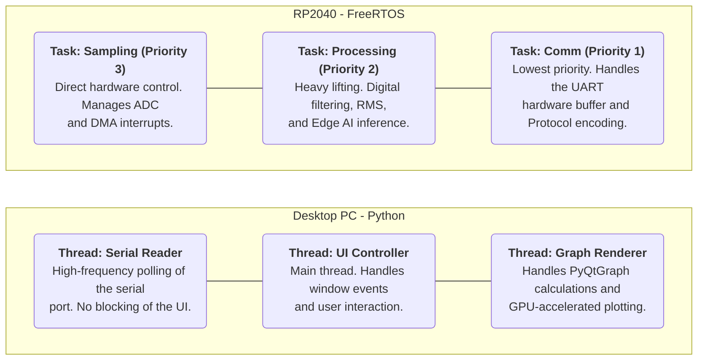
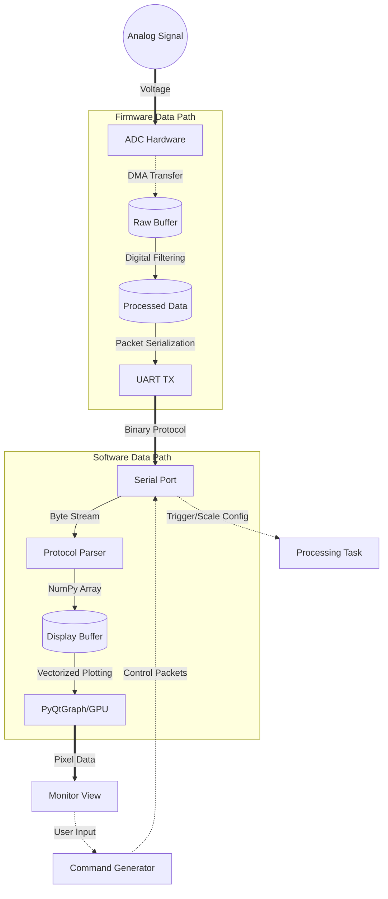

# Oscipi: Raspberry Pi Pico Oscilloscope

[](https://github.com/AndresCasasola/oscipi/actions)
[](https://opensource.org/licenses/MIT)
[](https://www.raspberrypi.com/documentation/microcontrollers/raspberry-pi-pico.html)

**Oscipi** is a digital oscilloscope powered by the RP2040. It features a robust C firmware backed by a real-time Python user interface.

---

## 1. Features

* **Real-Time Visualization:** High-performance GUI using `PyQtGraph` for low-latency signal rendering.
* **Bunkerized Architecture:** All dependencies (SDK, FreeRTOS, Unity) are encapsulated within the repository as git submodules.
* **Test-Driven Development:** Firmware logic validated via Unity unit testing framework with a dedicated native test runner.
* **Automated CI/CD:** GitHub Actions pipeline for automated testing and firmware compilation (.uf2).

## 2. Repository Structure

```text
.
├── .github/                # CI/CD Workflows (GitHub Actions)
├── cmake/                  # Modular CMake scripts
├── gui/                    # Desktop Application (Python + PyQtGraph)
│   └── main_ui.py          # Main Entry point for the GUI
├── lib/                  # THE BUNKER: External dependencies (Submodules)
│   ├── FreeRTOS-Kernel/  # Real-Time OS Kernel
│   ├── pico-sdk/         # Raspberry Pi Pico Official SDK
│   └── unity/            # Unity Test Library
├── scripts/                # Automation scripts (Agnostic build & test runners)
│   ├── run_tests.ps1       # Native Unit Test runner (PowerShell)
│   └── build_firmware.ps1  # Firmware compilation helper
├── src/                    # Firmware Source Code (C / FreeRTOS)
│   ├── main.c              # Application Entry & Tasks
│   └── FreeRTOSConfig.h    # Kernel Configuration
├── test/                   # Unit Tests (C / Unity Framework)
├── .gitignore              # Version control exclusion rules
├── .gitmodules             # Git submodule configuration and paths
├── CMakeLists.txt          # Build configuration for Raspberry Pi Pico
├── requirements.txt        # Python package dependencies
├── run_gui.bat             # One-click launcher (Windows)
└── run_gui.sh              # One-click launcher (Linux/macOS)
```

## 3. Getting Started (Firmware)
### Prerequisites:
To keep this project editor-agnostic, ensure the following tools are in your system PATH:

- **ARM GCC Toolchain:** For cross-compiling to the RP2040.
- **Native GCC:** (e.g., MinGW on Windows) For running local unit tests.
- **CMake & Ninja:** Build system and generator.
- **Python 3.10+:** For the GUI and auxiliary scripts.

**Click here to see how to install this tools and add them to your system PATH.**

### Local Unit Testing (Agnostic)
You don't need a Pico to verify the logic. Simply run the automated script:

```PowerShell
# Run tests using the local GCC compiler
./scripts/run_tests.ps1
```
Note: This script creates a temporary build_tests/ directory to keep your workspace clean.

### Compilation
The project is designed to be built from any terminal, independent of VS Code or other IDEs:
```powershell
# 1. Configure project (Detects local lib/pico-sdk automatically)
cmake -S . -B build -G Ninja

# 2. Build firmware
cmake --build build
```

### Flashing the Pico
You can use the picotool utility to flash without touching the hardware:
``` PowerShell
# 1. Force the Pico into BOOTSEL mode via USB
picotool reboot -f -u
# 2. Upload and execute the binary
picotool load -x app.uf2
```

Note: If picotool is not available, hold the BOOTSEL button while connecting the Pico and drag the .uf2 file into the RPI-RP2 drive.

## 4. System Architecture

The project is split into two main domains: the **Real-Time Firmware** (RP2040) and the **High-Level UI** (Python).





## 5. Threading & Communication

To ensure a smooth user experience without "freezing" the interface, the application implements a **Producer-Consumer** pattern:

1.  **Firmware Side (The Producer):**
    * **Core 0:** Handles the main oscilloscope logic and ADC sampling at a fixed frequency.
    * **UART:** Samples are packed into a custom binary protocol to maximize throughput over the serial port.

2.  **Software Side (The Consumer):**
    * **Serial Thread:** A dedicated background thread continuously listens to the COM port. This prevents the GUI from lagging while waiting for data.
    * **Queue Management:** Data is passed to the UI using a thread-safe buffer.
    * **UI Thread (PyQtGraph):** Every 20ms, the UI "wakes up," grabs the latest batch of samples from the buffer, and updates the plot using vectorized NumPy operations.

## 6. Development Tips
### Quality of Life (Linux)
Many Linux distros don't come with the venv module installed by default. If you encounter errors creating the environment, run:

```Bash
sudo apt install python3-venv
```

### Editor Independence
While VS Code is supported via the CMake Tools extension, it is not required. The project can be fully managed via CLI using the scripts provided in /scripts.

### Unit Testing Strategy
Tests are compiled for the host architecture (Windows/Linux) using the -DUNIT_TEST flag. This flag is used in src/ to mock hardware-specific headers (like hardware/adc.h) that are not available on a PC.

### Submodule Management
If you cloned the repository without submodules, initialize the bunker with:
```Bash
git submodule update --init --recursive
```
Anyway the project uses custom cmake/X_import.cmake scripts. If you clone the repo without --recursive, simply running cmake will automatically detect the missing files and perform a git submodule update to the correct version.

### FreeRTOS Insight
The kernel is configured to handle the RP2040's architecture with specific mapping for `isr_svcall`, `isr_pendsv`, and `isr_systick` to ensure the RTOS scheduler takes control of the hardware interrupts.