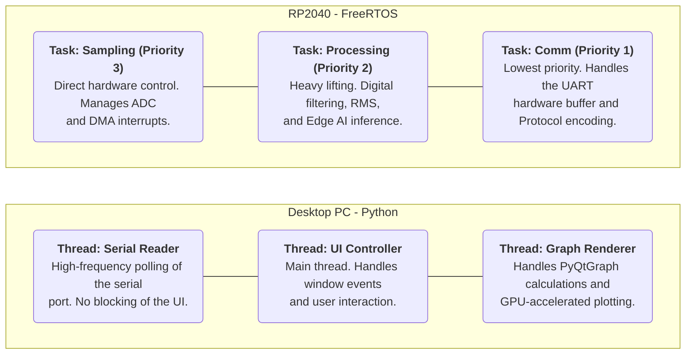
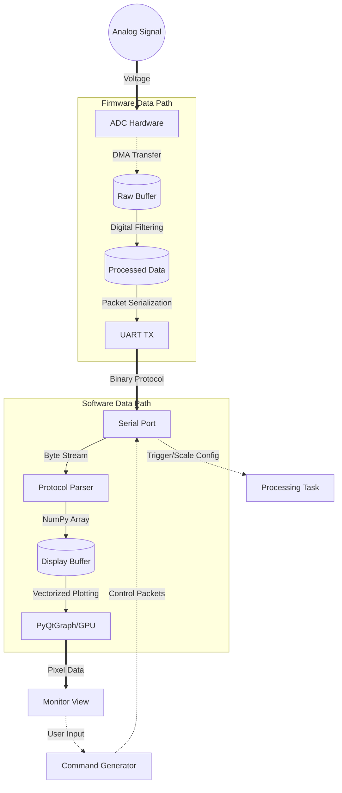

# Oscipi: Raspberry Pi Pico Oscilloscope

[](https://github.com/AndresCasasola/oscipi/actions)
[](https://opensource.org/licenses/MIT)
[](https://www.raspberrypi.com/documentation/microcontrollers/raspberry-pi-pico.html)

**Oscipi** is a digital oscilloscope powered by the RP2040. It features a robust C firmware backed by a real-time Python user interface.

---

## 1. Features

* **Real-Time Visualization:** High-performance GUI using `PyQtGraph` for low-latency signal rendering.
* **Test-Driven Development:** Firmware logic validated via `Unity` unit testing framework.
* **Automated CI/CD:** GitHub Actions pipeline for automated testing and firmware compilation (`.uf2`).
* **Cross-Platform:** One-click launchers for Windows and Linux environments.

## 2. Repository Structure

```text
.
├── .github/            # CI/CD Workflows (GitHub Actions)
├── gui/                # Desktop Application (Python + PyQtGraph)
│   └── main_ui.py      # Main Entry point for the GUI
├── src/                # Firmware Source Code (C / Pico SDK)
├── test/               # Unit Tests (C / Unity Framework)
├── unity/              # Unity Test Library source
├── .gitignore          # Version control exclusion rules
├── CMakeLists.txt      # Build configuration for Raspberry Pi Pico
├── requirements.txt    # Python package dependencies
├── run_gui.bat         # One-click launcher (Windows)
└── run_gui.sh          # One-click launcher (Linux/macOS)
```

## 3. Getting Started (Firmware)
### Prerequisites:
- Pico SDK v2.2.0+
- ARM GCC Toolchain
- Ninja (Recommended) or Make.
- picotool (Essential for a smooth workflow).

### Compilation
From the project root:
```powershell
# 1. Create and enter build directory
# Pro tip: If you want a clean rebuild, delete everything inside 'build' first:
# Remove-Item -Recurse -Force * (Execute from build directory)
cd build
# 2. Configure project
cmake .. -G Ninja
# 3. Build firmware
cmake --build .
```

### Flashing the Pico
You can use the picotool utility to flash without touching the hardware:
``` PowerShell
# 1. Force the Pico into BOOTSEL mode via USB
picotool reboot -f -u
# 2. Upload and execute the binary
picotool load -x app.uf2
```

Note: If picotool is not available, hold the BOOTSEL button while connecting the Pico and drag the .uf2 file into the RPI-RP2 drive.

## 4. System Architecture

The project is split into two main domains: the **Real-Time Firmware** (RP2040) and the **High-Level UI** (Python).





## 5. Threading & Communication

To ensure a smooth user experience without "freezing" the interface, the application implements a **Producer-Consumer** pattern:

1.  **Firmware Side (The Producer):**
    * **Core 0:** Handles the main oscilloscope logic and ADC sampling at a fixed frequency.
    * **UART:** Samples are packed into a custom binary protocol to maximize throughput over the serial port.

2.  **Software Side (The Consumer):**
    * **Serial Thread:** A dedicated background thread continuously listens to the COM port. This prevents the GUI from lagging while waiting for data.
    * **Queue Management:** Data is passed to the UI using a thread-safe buffer.
    * **UI Thread (PyQtGraph):** Every 20ms, the UI "wakes up," grabs the latest batch of samples from the buffer, and updates the plot using vectorized NumPy operations.

## 6. Development Tips
### Quality of Life (Linux)
Many Linux distros don't come with the venv module installed by default. If you encounter errors creating the environment, run:

```Bash
sudo apt install python3-venv
```

### FreeRTOS Insight
The kernel is configured to handle the RP2040's architecture with specific mapping for `isr_svcall`, `isr_pendsv`, and `isr_systick` to ensure the RTOS scheduler takes control of the hardware interrupts.