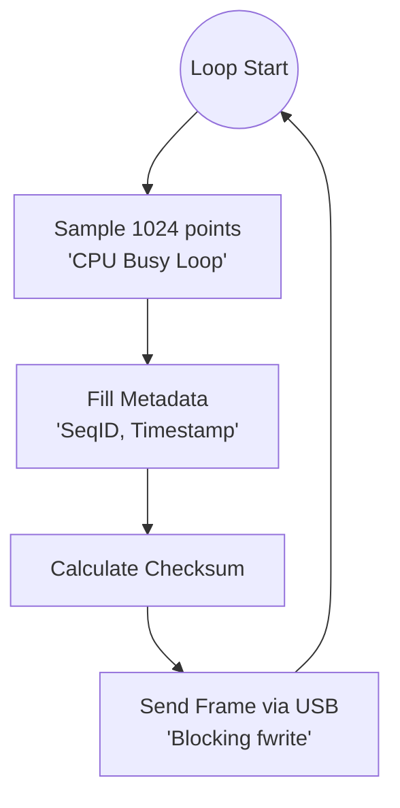
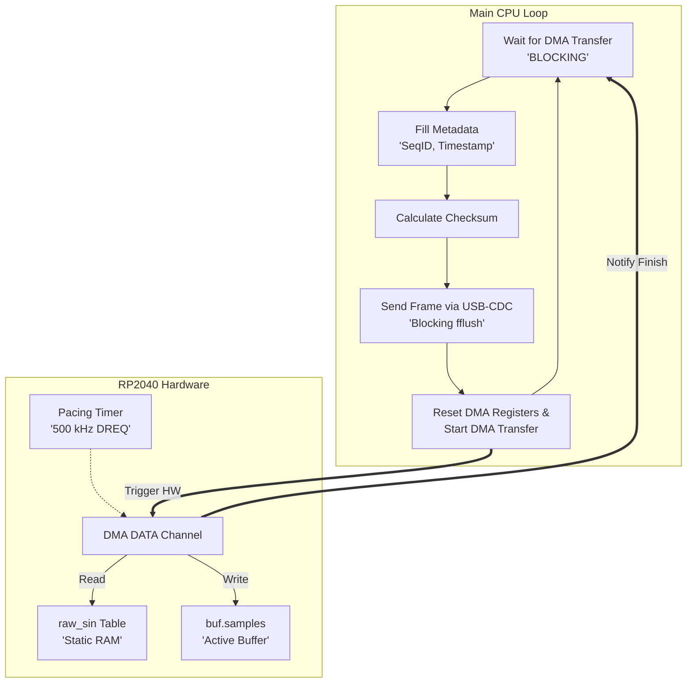

# Oscipi Docs

This document provides deep technical details, architectural decisions, and lab experiment measurements for each milestone of the Oscipi project.

---

## v0.1 - Manual CPU Sampling (Proof of Concept)

The v0.1 milestone was the initial "Hello World" of the project, focusing on establishing a basic Python-to-Pico communication link.

### 1. Architecture: The Sequential Super-Loop

In this version, all operations were handled sequentially by the CPU in a simple loop. There was no hardware acceleration or deterministic pacing.

*   **Pacing:** Attempted using software delays (`sleep_ms`).
*   **Data Generation:** Synthetic sine wave generated on-the-fly using `sin()` math functions.
*   **Transport:** Data was sent as binary chunks using `fwrite`.



### 2. Elementary Data Structure (`adc_buffer_t`)

Even in its most primitive form, the project established a strict memory layout to ensure the Python GUI could parse packets reliably. This structure remains the core of the Oscipi protocol:

```c
typedef struct {
    // Metadata for traceability
    uint32_t sequence_id;     // Incremental counter
    uint32_t timestamp_us;    // MCU uptime when buffer was filled
    
    // System state
    uint8_t  flags;           // Bitmask (e.g., Overflow: 0x01)
    
    // ADC Data (1024 samples of 12-bit data)
    uint16_t samples[1024];   
} adc_buffer_t;
```

### 2. Key Learnings & Failure Modes

*   **Non-Determinism:** The actual throughput was ~20% lower than calculated (~0.8 FPS vs 1.0 FPS target). This was due to the hidden overhead of the USB CDC stack and the floating-point math for sine calculation.
*   **Jitter:** The time between samples varied significantly, making the signal appear "shaky" on the GUI.
*   **Conclusion:** Software-only timing is insufficient for oscilloscope-grade precision. Hardware peripherals (DMA/Timers) are mandatory.


## v0.2 - DMA (Single Buffer)

The v0.2 milestone represents the transition from software-timed loops to hardware-deterministic sampling. The goal was to establish a high-speed data pipe (~500 kHz) and instrument it to identify system bottlenecks.

### 2. Implementation: Hardware-Paced Sampling

The v0.2 transition moved the sampling responsibility to the **RP2040 DMA Engine**. 

*   **DMA DREQ Pacing:** A hardware timer triggers the DMA transfer every 2 µs (500 kHz).
*   **DMA Chaining:** A control channel automatically resets the read address, creating an infinite loop of the synthetic sine table without CPU intervention.



### 3. The Granular Telemetry Extension (`v0.2.x`)

To debug the throughput issues discovered in v0.2, we introduced the **Telemetry Envelope**. This follows the *Open/Closed Principle*: we wrapped the existing `adc_buffer_t` without modifying its internal structure.

#### Data Structure: `telemetry_frame_t`

```c
typedef struct {
    // Performance Metrics (20 bytes)
    uint32_t dma_us;           // Time HW DMA transfer took
    uint32_t metadata_us;      // Time spent in CPU overhead
    uint32_t checksum_us;      // Time spent in CRC calculation
    uint32_t usb_transport_us; // Time blocked by USB transport
    uint32_t total_loop_us;    // Total cycle time
    
    // Wrapped Original Structure
    adc_buffer_t adc_buf; 
} telemetry_frame_t;
```

#### Binary Frame Layout
The data is flushed to `stdout` in the following binary order:

| Size (Bytes) | Field | Description |
|---|---|---|
| 2 | **Header** | `0xAA 0x55` for frame synchronization. |
| 20 | **Telemetry Envelope** | 5x `uint32_t` measuring µs for: DMA wait, Metadata, Checksum, USB Tx, and Total Loop. |
| 4 | **Sequence ID** | Monotonically increasing counter to detect dropped frames. |
| 4 | **Timestamp** | MCU uptime in microseconds when the frame was processed. |
| 2 | **Flags** | Status bits (padding/future use). |
| 2048 | **Samples** | 1024 samples of 16-bit data (raw ADC values). |
| 2 | **Checksum** | 16-bit XOR result of metadata and samples. |

### 3. Granular Telemetry Strategy

One of the most critical features of v0.2 is the **Micro-Phase Instrumentation**. By wrapping each logic block in `time_us_32()` calls, the firmware reports its internal state back to the GUI:

```c
// Example of instrumentation loop
t_frame.total_loop_us = time_us_32() - t_start_loop;
t_start_loop = time_us_32();

dma_channel_wait_for_finish_blocking(chan_data); // Wait for HW
t_frame.dma_us = time_us_32() - t_dma_start;

// ... calculate checksum and metadata ...

fwrite(header, 1, HEADER_SIZE, stdout);
fflush(stdout); // Blocking USB transport
t_frame.usb_transport_us = time_us_32() - t_usb_start;
```

### 4. Results: The "Half-Success" Discovery

The telemetry data extracted in this version led to a breakthrough in understanding the RP2040's streaming limits:

1.  **Sampling Determinism (FIXED):** Internal jitter within the 1024-sample window was reduced to **0%**. The hardware DREQ ensures each sample is captured at exactly 2 µs intervals.
2.  **Transport Non-Determinism (PENDING):** While sampling is perfect, the **inter-packet interval** remains highly unstable. Because the CPU must wait for the USB CDC acknowledgement (`fflush`) before restarting the DMA, any host-side latency translates directly into **Packet Jitter**.
3.  **Temporal Blindness:** In this single-buffer design, the system is "blind" (not sampling) during 99% of its uptime. The gaps between frames are inconsistent, making it impossible to reconstruct a continuous signal over long periods.

> [!IMPORTANT]
> The v0.2 milestone proved that hardware pacing solves **Sampling Jitter**, but a single-buffer architecture cannot solve **Transport Jitter**. This is the primary architectural driver for the v0.3 "Ping-Pong" (Double Buffer) evolution.
