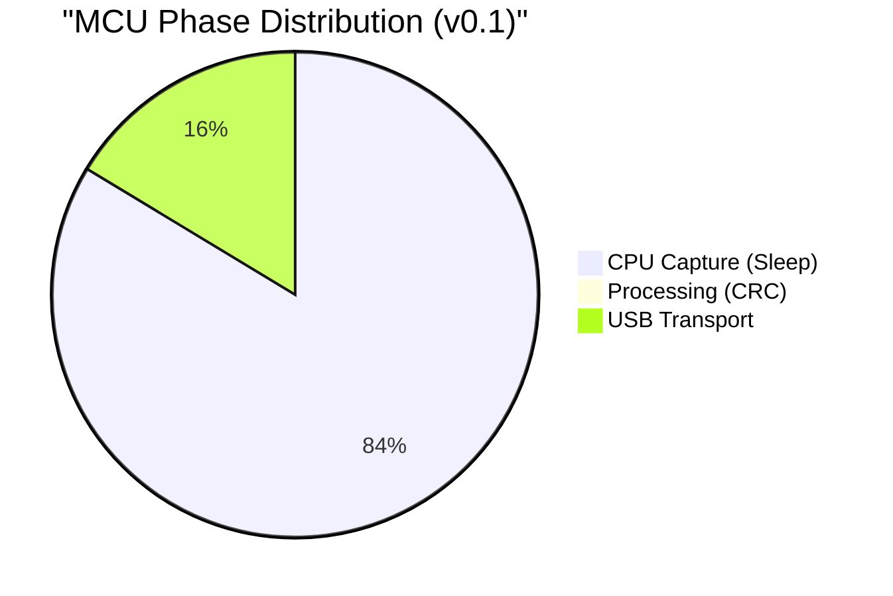
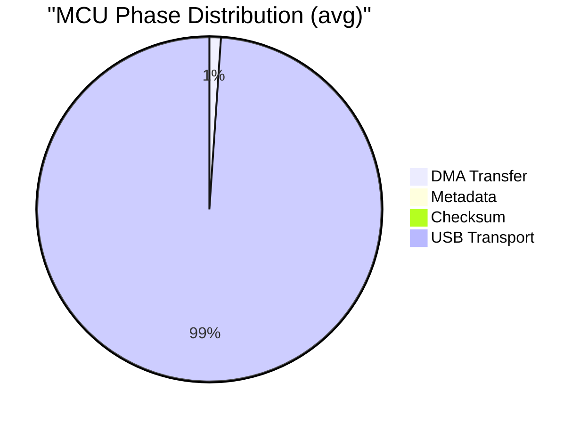
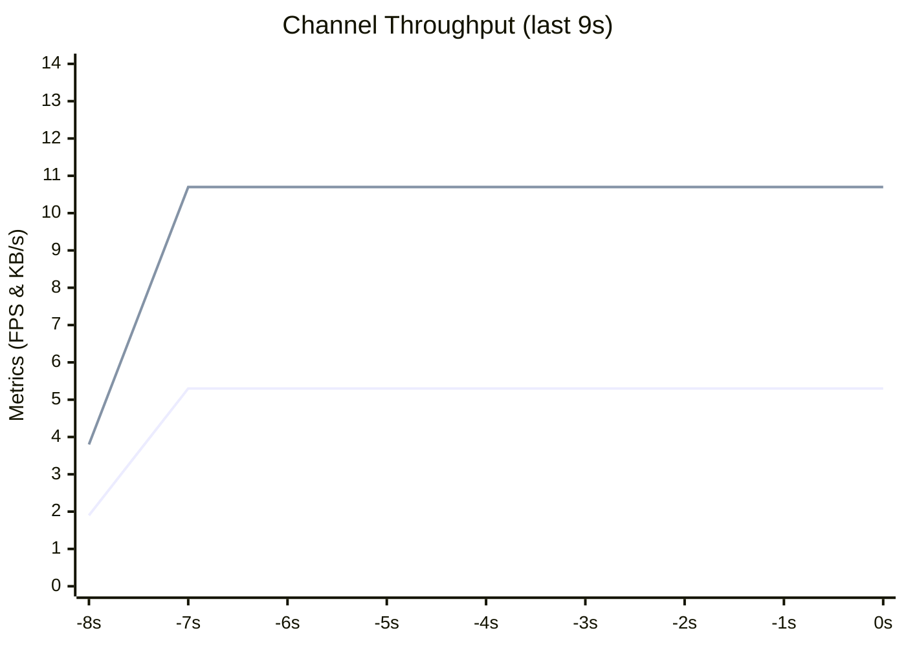

# Oscipi Reports

## v0.1 - Manual CPU Sampling

### 1. Performance Measurement
| Phase | Operation | Estimated Time | Estimation Method |
| :--- | :--- | :--- | :--- |
| **Capture** | **Software Delay Loop** | **768 ms** | **Mathematical:** $1024 \text{ samples} \times 750 \mu\text{s}$. |
| **Processing** | Metadata & Checksum | **~20 µs** | **Cycle Counting:** Minimal CPU overhead. |
| **I/O** | **USB-CDC Send** | **~150 ms** | **Empirical:** Typical blocking time for a 2KB buffer on a generic host. |

### 2. Measured Data (Estimations)

#### Internal MCU Phase Distribution

| Phase | Duration (µs) | Duty Cycle (%) |
| --- | --- | --- |
| **CPU Capture (Sleep)** | 768,000 | 83.7% |
| **Processing (CRC)** | 20 | 0.0% |
| **USB CDC Transport** | 150,000 | 16.3% |
| **Total Loop Cycle** | **918,020** | **100%** |

### 3. Technical Analysis

#### The "Artifical" Bottleneck
In this version, the system is intentionally slow. The CPU spends **83.7%** of its time executing `sleep_us()` to simulate a low-frequency capture. This makes the system extremely inefficient, as the processor is "spinning" without performing any useful work for the majority of the cycle.

#### Timing Jitter
Because the timing is handled by software delays, any internal MCU interrupts or background processing causes immediate jitter in the sample spacing. This results in a "wavering" signal when visualized in the Python GUI.

### 4. Conclusion & Upgrade Path
The v0.1 proof-of-concept confirmed the feasibility of the custom framing protocol but highlighted the catastrophic inefficiency of software-timed loops.

**Decision:** Delegate timing to the **Hardware Timer** and data movement to the **DMA Engine** to achieve kHz/MHz speeds and 0% capture jitter.

## v0.2 - DMA (Single Buffer)

### 1. Experiment Overview

* **Target:** Measure the execution time of each micro-phase within the main loop using the v0.2.4 Granular Telemetry layer.
* **Hardware:** Raspberry Pi Pico (RP2040) @ 125 MHz.
* **Sample Rate:** 500 kHz (2 µs per sample).
* **Buffer Size:** 1024 samples (16-bit).

### 2. Measured Data (Averages)

#### Internal MCU Telemetry

| Phase | Duration (µs) | Duty Cycle (%) |
| --- | --- | --- |
| **DMA Hardware Transfer** | 2,047 | 1.1% |
| **Metadata Handling** | 0* | 0.0% |
| **Checksum Calculation (XOR)** | 25 | 0.0% |
| **USB CDC Transport** | 188,180 | 98.9% |
| **Total Loop Cycle** | **190,254** | **100%** |
| *Measurement below 1 µs timer resolution. | | |

#### Communication Channel Troughput (USB-OTG)

| Metric | Value |
| --- | --- |
| **Avg. Throughput** | 9.92 KB/s |
| **Avg. Frame Rate** | 4.88 FPS |
| **Min Frame Rate** | 1.86 FPS |
| **Max Frame Rate** | 5.26 FPS |
| **Total Frames** | 50 |
| **Total Data** | 0.10 MB |
| **CRC Errors** | 0 (0.00%) |
| **Effective Sample Rate** | 4,996 S/s |

### **3. Technical Analysis**

#### Hardware Precision

The DMA transfer time of **2,047 µs** validates the DREQ pacing logic. At 500 kHz, 1024 samples should take exactly $2,048 \mu s$. The hardware is performing with near-perfect determinism, independent of the CPU state.

#### The "Thief" in the Pipe (USB Latency)

The report identifies **USB Transport** as the catastrophic bottleneck, consuming **98.9%** of the system's time. This delay is not caused by the MCU's processing power, but by the synchronous nature of the USB CDC protocol and the host's (PC) acknowledgement cycle.

#### Temporal Blindness (The Gap)

Since this is a single-buffer architecture, the DMA is idle while the CPU is blocked by the `fflush(stdout)` call.

* **Observation Window:** 2.05 ms.
* **Blind Spot:** 188.10 ms.
* **System Status:** The oscilloscope is **"blind" 98.9% of the time**. It only captures a snapshot of the signal and then ignores the real world for nearly 190 ms.

### **4. Conclusion & Upgrade Path**

The v0.2 architecture successfully offloaded the *movement* of data to the hardware but failed to achieve *continuity*.

**Decision:** The project must move to **v0.3: Double Buffering (Ping-Pong)**. By implementing two independent buffers, the DMA can keep "listening" to the signal in Buffer B while the CPU is "talking" to the USB in Buffer A. This will effectively hide the 188ms transport latency and eliminate the "blind spot," transforming Oscipi into a true real-time instrument.
