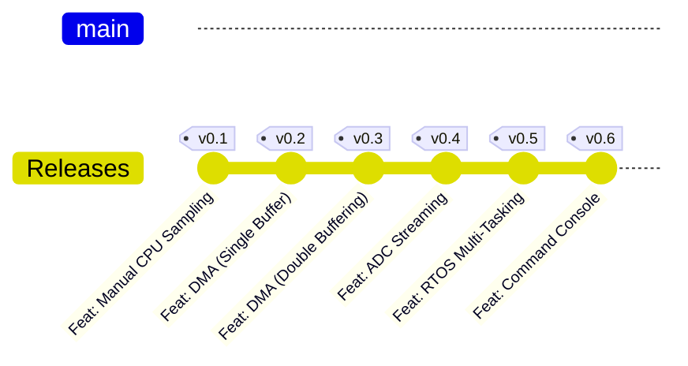

# Oscipi Project Evolution

This document tracks the architectural milestones and version history of the Oscipi project.

---

### v0.1: Feat: Manual CPU Sampling

#### Description

This was the initial proof of concept. The CPU handled the entire signal chain: calculating sine values, handling timing via software delays (`sleep_ms`), and pushing data over USB.

#### Features

* Software-generated sine wave.
* Basic framing protocol (Header + Metadata + Payload + Checksum).
* Single-threaded blocking execution.

#### Limitations & Upgrade Path

The main limitation was the high Jitter and "Phase Jumps." Timing was artificial and inconsistent because it relied on CPU cycles. The system was 100% blocked during data transmission. The next step required moving timing responsibility to the hardware.

<b>v0.1.1: Feat: Python/Qt GUI Foundation</b>

Description

This version establishes the desktop software counterpart to the hardware. A robust, high-performance Graphical User Interface built with PyQt5 and pyqtgraph to visualize the data streams coming from the RP2040. It also introduces a "Packet Inspector" for advanced debugging and hardware emulation capabilities for testing without the physical MCU.

#### Features

* **High-Speed Real-Time Plotting**: Using `pyqtgraph` and numpy to render signals at 60 FPS without UI freezes.
* **Hardware Emulator (`hw_emulator.py`)**: A standalone virtual signal generator (Sine, Square, Triangle, Noise) that outputs data via a TCP socket mimicking the MCU's framing protocol.
* **Packet Inspector**: A dedicated auditing tab implementing a massive, pre-allocated Circular Buffer capable of holding gigabytes of packet history in RAM. Uses `QAbstractTableModel` for ultra-fast scrolling and searching.
* **Custom Styling**: A fully customized "Dark/Neon" aesthetic using CSS-like Qt stylesheets for a professional lab tool feel.
* **Resilient Connection Handling**: Auto-recovery and clear error reporting when UART connections drop or fail.

#### Limitations & Upgrade Path

Currently, the UI is purely a passive listener (it receives data and visualizes it). The next major UI step (matching hardware v0.6) will be implementing a bidirectional command system to actively control the hardware parameters (trigger levels, frequency, channels) directly from the GUI.

---

### v0.2: Feat: DMA (Single Buffer)

#### Description

This version offloads data movement to the DMA hardware using a paced Timer (DREQ). It introduces a sophisticated Telemetry Envelope to monitor system performance in real-time.

#### Features

* Hardware-paced DMA data transfer (500 kHz sampling target).
* DMA Control Channel for automatic read-address resetting.
* **Granular Performance Profiling**: Individual tracking of DMA hardware time, Metadata overhead, Checksum calculation, and USB transport latency.

#### Limitations & Upgrade Path

**Temporal Blindness**: Because it uses a single buffer, the DMA must stop while the CPU sends the frame over USB (the "Gap"). The CPU is still blocked waiting for the USB transport ACK. The next upgrade must allow the hardware to keep sampling while the CPU is busy communicating.

---

### v0.3: Feat: DMA (Double Buffering)

#### Description

Introduces a two-buffer system (Ping-Pong). The DMA hardware fills Buffer A while the CPU processes and transmits Buffer B. When both finish, they swap roles.

#### Features

* Zero-gap sampling (Continuous data stream).
* Asynchronous operation between sampling hardware and communication software.
* Cross-triggering DMA channels to handle the swap automatically.

#### Limitations & Upgrade Path

Managing multiple DMA channels and synchronization flags in a bare-metal environment becomes complex and hard to maintain as features grow. The logical progression is to implement a scheduler to manage these concurrent states.

---

Tienes toda la razón, se me cruzaron los cables con el orden de las versiones. He reajustado el contenido para que coincida exactamente con la progresión lógica que definiste: primero la entrada de datos reales (**ADC Streaming**), luego la migración al sistema operativo (**RTOS**) y finalmente la capacidad de control (**Command Console**).

---

### v0.4: Feat: ADC Streaming

#### Description

The shift from synthetic data to real-world signals. The pre-calculated sine wave is replaced by the RP2040’s Internal ADC, maintaining the high-speed Double Buffering logic.

#### Features

* **Hardware ADC Integration**: Direct sampling from physical pins.
* **High-Speed Streaming**: Optimized ADC-to-DMA-to-Memory path.
* **Signal Integrity**: Real-time capture with no gaps between frames.

#### Limitations & Upgrade Path

Managing the ADC, DMA, and USB simultaneously in a single loop starts to hit the limits of bare-metal maintainability. The system needs a scheduler to manage task priorities.

---

### v0.5: Feat: RTOS Multi-Tasking

#### Description

A major architectural shift to **FreeRTOS**. The system transitions from a sequential loop to a task-based architecture, providing better determinism and resource management.

#### Features

* **Preemptive Scheduling**: High-priority tasks for DMA/ADC management and lower-priority tasks for communication.
* **Thread-Safe Buffering**: Use of RTOS primitives (Semaphores/Task Notifications) for safe buffer swapping.
* **Improved Modularity**: Clean separation of hardware drivers and application logic.

#### Limitations & Upgrade Path

The system is robust but still "dumb"—it only sends data. The next step is adding a control layer to allow the UI to modify parameters in real-time.

---

### v0.6: Feat: Command Console

#### Description

Full implementation of a bidirectional communication protocol. The Python/Qt UI can now configure hardware parameters on the fly via a dedicated Command Task.

#### Features

* **Bi-directional Communication**: Dedicated task to parse incoming USB control packets.
* **Real-time Configuration**: Adjust sampling rate, triggers, and channel selection without resetting the MCU.