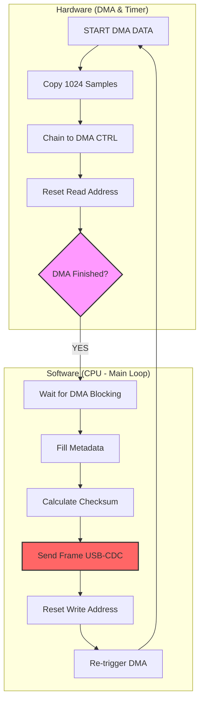

# Technical Documentation: Oscipi v0.2
## DMA Capture Architecture with Sequential Blocking

### 1. The v0.2 Concept
In this version, we move away from software-based sampling (`sleep_ms`) toward **Hardware-Timed Sampling**. The goal is to ensure that the time between samples is atomic and precise by delegating data movement to the **DMA (Direct Memory Access)** controller.

### 2. Logic Flow Diagram
This diagram illustrates the "Logic Gymkana" happening in the firmware. Note how the DMA and CPU take turns, creating a strictly sequential execution.

---

### 3. Timing Analysis & Estimation

To understand the system behavior, we must break down the "time budget" consumed by each component of the machine.

| Phase | Operation | Estimated Time | Estimation Method |
| :--- | :--- | :--- | :--- |
| **Hardware** | DMA Transfer | **2.048 ms** | **Mathematical:** $1024 \text{ samples} \times (250 / 125\text{MHz})$. Strictly deterministic. |
| **Software** | Metadata Logic | **~5 µs** | **Cycle Counting:** Simple RAM write instructions (CPU @ 125MHz). |
| **Software** | Checksum (XOR) | **~15 µs** | **Algorithmic:** 1024-iteration loop. Approx 2-3 cycles per iteration. |
| **I/O** | **USB-CDC Send** | **~185 ms** | **Empirical:** Based on the observed **10.6 KB/s** throughput in the console. |

#### Why is the USB so slow?
The USB CDC (Virtual Serial Port) is the ultimate bottleneck. Even if the baudrate is set to 921600, real speed depends on USB frames (1ms intervals) and OS latency (Windows/Linux polling). Since each frame is **2062 bytes**, it takes roughly **190-200ms** to be fully acknowledged by the Host PC.

---

### 4. Explaining the 5 FPS "Wave Jumping"

By adding the hardware and software times, we get the **System Duty Cycle**:
$$T_{cycle} = T_{DMA} (2ms) + T_{USB} (200ms) \approx 202ms$$

**Why do we see 5.3 FPS in Python?**
1.  **Frame Rate:** $1 / 0.202s \approx \mathbf{5 \text{ FPS}}$. The console confirms this with readings around 5.3 FPS.
2.  **Phase Synchronization:** Since the buffer (1024) matches the exact period of the generated sine wave, every time the UI refreshes, it "paints" a static period. It feels like it jumps because the waiting time (200ms) is massive compared to the capture time (2ms).
3.  **Burst Loading:** Python receives the full 2KB only after the USB transmission is finished, causing the UI to process a huge "chunk" of data instantly after a long silence.

---

### 5. Critical Limitations (Lessons for v0.3)

1.  **Temporal Blindness (The Gap):** The system is "blind" 99% of the time. While the CPU is busy sending data (200ms), the DMA is idle. We only capture data for 2ms out of every 202ms.
2.  **Tight Coupling:** Sampling depends on the transmission finishing. If the PC lags, the oscilloscope stops sampling entirely.

**The Evolutionary Step:** Implementing **Double Buffering**. This will allow the DMA to fill `Buffer_B` while the CPU is still struggling to send `Buffer_A` over the USB, eliminating "dead time" and allowing for a truly continuous data stream.

---

*This documentation serves as a foundation for explaining how even the fastest hardware (DMA) can be throttled by a slow transport protocol (USB) if the architecture remains synchronous.*